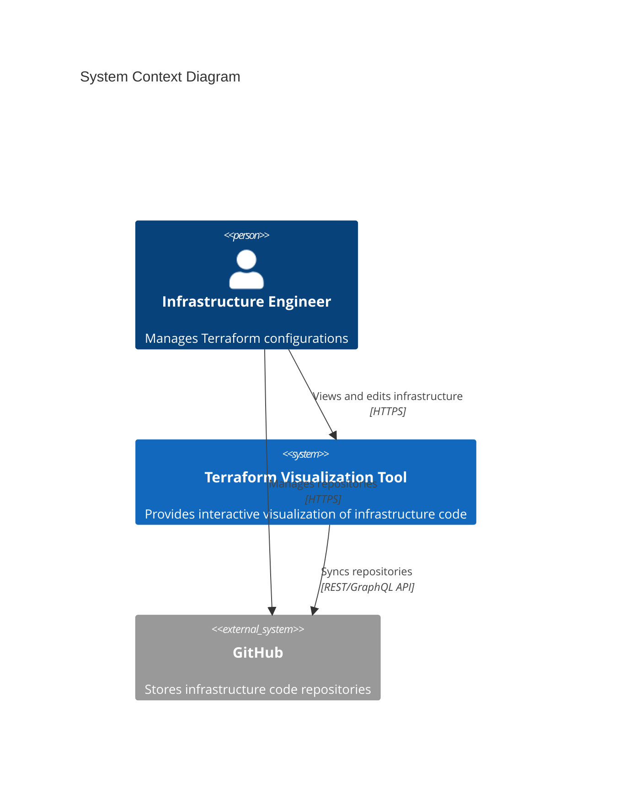

# Terraform Visualization Tool

[](https://github.com/terraform-visualizer/terraform-visualizer/actions)
[](https://codecov.io/gh/terraform-visualizer/terraform-visualizer)
[](https://opensource.org/licenses/MIT)
[](https://badge.fury.io/js/terraform-visualizer)

## Overview

The Terraform Visualization Tool is a powerful web-based application designed to provide interactive visualization and management capabilities for Terraform infrastructure code. It addresses the critical challenge of understanding complex infrastructure relationships and dependencies across multiple environments and modules.

### Key Features

- **Multi-level Visualization**
  - Pipeline View: High-level overview of deployment workflows
  - Environment View: Detailed environment-specific resource mapping
  - Module View: In-depth module relationships and dependencies

- **Real-time Code Editing**
  - Instant visualization updates
  - HCL2-compliant syntax highlighting
  - Integrated validation and error checking

- **GitHub Integration**
  - Direct repository import and synchronization
  - Version control integration
  - Collaborative workflow support

- **Interactive Infrastructure Exploration**
  - Drag-and-drop graph manipulation
  - Zoom and pan capabilities
  - Context-aware node inspection

- **Comprehensive Dependency Analysis**
  - Resource relationship mapping
  - Cross-module dependency tracking
  - Impact analysis visualization

## Architecture

### System Context



### Core Components

- **Frontend Application**
  - Technology: React 18.x, React Flow 11.x, Monaco Editor
  - Purpose: User interface and interactive visualization
  - Features: Real-time updates, responsive design, accessibility support

- **Parser Service**
  - Technology: Node.js 18.x LTS, HCL2 Parser
  - Purpose: Terraform configuration processing
  - Features: High-performance parsing, validation, graph generation

- **API Gateway**
  - Technology: Express.js 4.x
  - Purpose: External communication management
  - Features: Rate limiting, authentication, caching

## Getting Started

### Prerequisites

#### Required Tools
- Node.js 18.x LTS or higher
- Docker 20.10.x or higher
- npm/yarn (latest version)

#### System Requirements
- CPU: 2+ cores recommended
- Memory: 4GB+ RAM recommended
- Storage: 1GB+ free space
- Supported Browsers: Chrome 90+, Firefox 88+, Safari 14+, Edge 90+

### Installation

1. Clone the repository:
```bash
git clone https://github.com/terraform-visualizer/terraform-visualizer.git
cd terraform-visualizer
```

2. Install dependencies:
```bash
npm install
```

3. Configure environment:
```bash
cp .env.example .env
```

4. Start development server:
```bash
npm run dev
```

## Features

### Visualization Views

#### Pipeline View
- High-level overview of deployment pipeline
- Environment status monitoring
- Cross-environment dependency visualization

#### Environment View
- Detailed resource mapping
- Environment-specific configurations
- Resource state visualization

#### Module View
- Module relationship diagrams
- Internal resource dependencies
- Configuration parameter visualization

### Code Editing

- Real-time syntax highlighting
- Auto-completion support
- Instant validation feedback
- Format-on-save capability

### GitHub Integration

- Repository synchronization
- Branch management
- Commit history tracking
- Pull request integration

## Development

### Development Setup

1. Configure development environment:
```bash
npm run setup:dev
```

2. Install development dependencies:
```bash
npm install --save-dev
```

3. Configure linting and formatting:
```bash
npm run setup:lint
```

### Testing

#### Unit Testing
```bash
npm run test
```

#### End-to-End Testing
```bash
npm run test:e2e
```

#### Coverage Report
```bash
npm run test:coverage
```

## Deployment

### Docker Deployment

1. Build Docker images:
```bash
docker-compose build
```

2. Start services:
```bash
docker-compose up -d
```

### Kubernetes Deployment

1. Apply Kubernetes configurations:
```bash
kubectl apply -f k8s/
```

2. Verify deployment:
```bash
kubectl get pods
kubectl get services
```

## Contributing

We welcome contributions! Please see our [Contributing Guide](CONTRIBUTING.md) for details on:
- Code of Conduct
- Development process
- Pull request guidelines
- Coding standards

## Security

For security concerns and vulnerability reporting, please review our [Security Policy](SECURITY.md).

## License

This project is licensed under the MIT License - see the [LICENSE](LICENSE) file for details.

## Support

- Documentation: [docs.terraform-visualizer.io](https://docs.terraform-visualizer.io)
- Issues: [GitHub Issues](https://github.com/terraform-visualizer/terraform-visualizer/issues)
- Discussions: [GitHub Discussions](https://github.com/terraform-visualizer/terraform-visualizer/discussions)

## Acknowledgments

- React Flow for graph visualization capabilities
- Monaco Editor for code editing functionality
- HashiCorp for Terraform and HCL specification