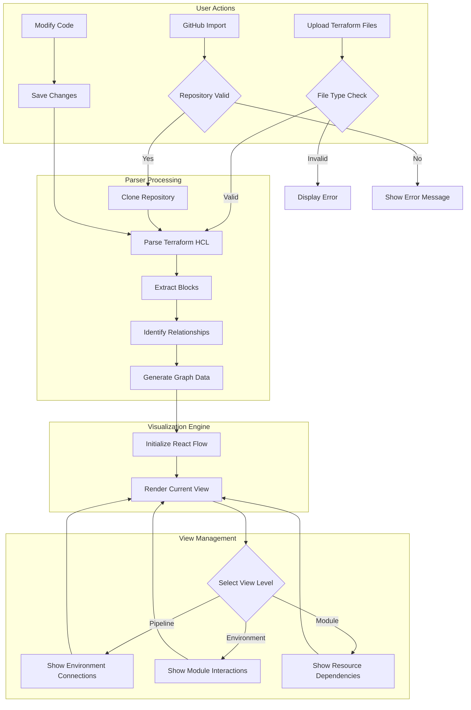
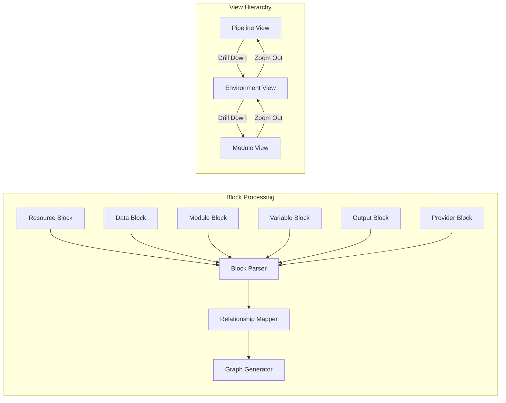
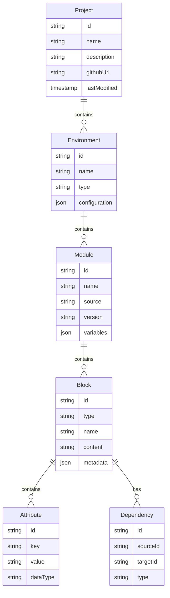
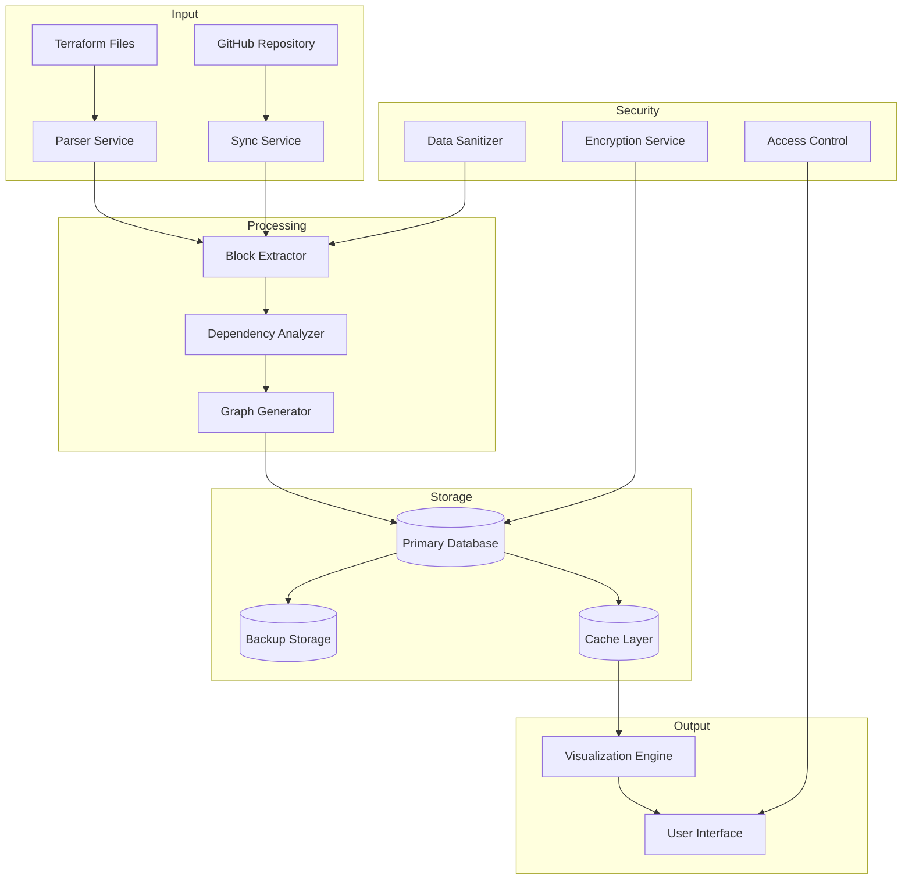
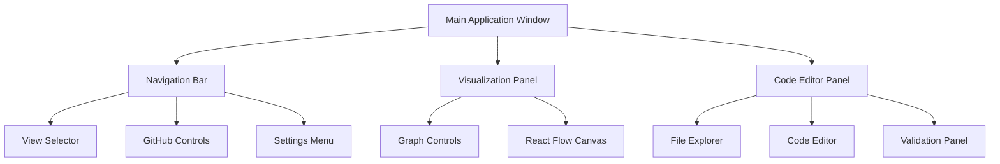
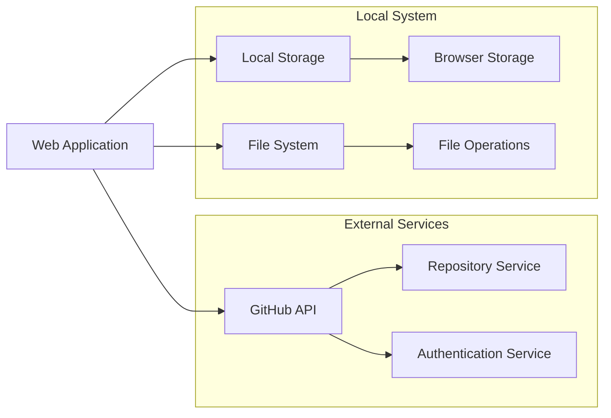

# Product Requirements Document (PRD)

# 1. INTRODUCTION

## 1.1 PURPOSE
This Product Requirements Document (PRD) specifies the requirements for developing a Terraform visualization tool. The document is intended for:
- Development team members implementing the solution
- Project stakeholders and managers overseeing the development
- Quality assurance teams validating the implementation
- Technical architects designing the system architecture
- Future maintainers of the system

## 1.2 SCOPE
The software will provide an interactive visualization platform for Terraform infrastructure code, enabling users to:

- Parse and visualize Terraform configuration files (.tf)
- Display hierarchical views of infrastructure at three distinct levels:
  - Release Pipeline View: Environment-to-environment connections
  - Environment View: Module-to-module relationships
  - Module View: Detailed resource connections and dependencies
- Render infrastructure components using React Flow for interactive graph visualization
- Support real-time updates when modifying Terraform code
- Enable seamless navigation between different visualization levels
- Integrate with GitHub for project import/export capabilities
- Parse various Terraform blocks including:
  - Resource blocks
  - Data blocks
  - Input blocks
  - Module blocks
  - Provider blocks
  - Variable blocks
  - Output blocks

The system will help infrastructure teams better understand their Terraform configurations, improve collaboration, and maintain complex infrastructure relationships more effectively.

# 2. PRODUCT DESCRIPTION

## 2.1 PRODUCT PERSPECTIVE
The Terraform visualization tool operates as a standalone web application that integrates with existing Terraform infrastructure code and GitHub repositories. It functions within the broader DevOps ecosystem, complementing existing infrastructure-as-code workflows by providing visual representations of infrastructure configurations. The system interfaces with:

- Local Terraform configuration files
- GitHub repositories for project management
- React Flow for rendering interactive visualizations
- Web browsers for user interface delivery

## 2.2 PRODUCT FUNCTIONS
The primary functions of the system include:

- Terraform Configuration Processing
  - Parse .tf files to extract infrastructure components
  - Identify relationships between resources, data sources, and modules
  - Validate configuration syntax and structure

- Multi-level Visualization
  - Release Pipeline View: Visualize environment-to-environment relationships
  - Environment View: Display module interactions within environments
  - Module View: Show detailed resource dependencies and connections

- Interactive Features
  - Real-time graph updates based on code modifications
  - Drag-and-drop node positioning
  - Zoom and pan capabilities
  - Click-through navigation between visualization levels

- Version Control Integration
  - GitHub repository import/export
  - Configuration file synchronization
  - Change tracking and history

## 2.3 USER CHARACTERISTICS
Target users include:

1. Infrastructure Engineers
   - Advanced knowledge of Terraform and IaC principles
   - Regular interaction with infrastructure configurations
   - Need for complex dependency visualization

2. DevOps Teams
   - Collaborative infrastructure management
   - Cross-team communication requirements
   - Mixed expertise levels in Terraform

3. System Architects
   - High-level infrastructure design responsibilities
   - Need for environment relationship visualization
   - Advanced technical background

## 2.4 CONSTRAINTS
1. Technical Constraints
   - Must support current Terraform HCL syntax
   - Browser compatibility requirements (Chrome, Firefox, Safari)
   - Performance limitations with large infrastructure graphs

2. Operational Constraints
   - Real-time updates must maintain system responsiveness
   - Graph layouts must remain readable with complex infrastructures
   - Memory usage optimization for large configurations

3. Security Constraints
   - Secure handling of infrastructure configuration data
   - GitHub authentication requirements
   - Access control for sensitive infrastructure information

## 2.5 ASSUMPTIONS AND DEPENDENCIES
Assumptions:
- Users have basic understanding of Terraform concepts
- Infrastructure configurations follow HCL best practices
- Users have access to necessary GitHub repositories
- Modern web browser availability

Dependencies:
- React Flow library for visualization
- GitHub API for repository integration
- Terraform HCL parser compatibility
- Web browser support for required features
- Network connectivity for GitHub operations

# 3. PROCESS FLOWCHART

# 4. FUNCTIONAL REQUIREMENTS

## 4.1 TERRAFORM PARSER
### ID: F-001
### Description
Parse and interpret Terraform configuration files to extract infrastructure components and relationships.
### Priority
High
### Requirements

| ID | Requirement | Priority |
|---|---|---|
| F-001.1 | Parse resource blocks including name, type, and attributes | High |
| F-001.2 | Parse data blocks and their dependencies | High |
| F-001.3 | Parse module blocks and their configurations | High |
| F-001.4 | Parse variable blocks and their default values | High |
| F-001.5 | Parse output blocks and their expressions | High |
| F-001.6 | Parse provider blocks and their configurations | Medium |
| F-001.7 | Validate Terraform syntax during parsing | High |
| F-001.8 | Support HCL2 syntax specification | High |

## 4.2 VISUALIZATION ENGINE
### ID: F-002
### Description
Generate and render interactive infrastructure visualizations using React Flow.
### Priority
High
### Requirements

| ID | Requirement | Priority |
|---|---|---|
| F-002.1 | Render nodes for each infrastructure component | High |
| F-002.2 | Display directed edges for dependencies | High |
| F-002.3 | Support custom node styling per component type | Medium |
| F-002.4 | Enable node dragging and repositioning | High |
| F-002.5 | Implement zoom and pan controls | High |
| F-002.6 | Auto-layout graph components | Medium |
| F-002.7 | Support real-time graph updates | High |
| F-002.8 | Maintain graph state during view transitions | Medium |

## 4.3 VIEW MANAGEMENT
### ID: F-003
### Description
Handle multiple visualization levels and transitions between views.
### Priority
High
### Requirements

| ID | Requirement | Priority |
|---|---|---|
| F-003.1 | Implement Release Pipeline View for environment connections | High |
| F-003.2 | Implement Environment View for module relationships | High |
| F-003.3 | Implement Module View for resource dependencies | High |
| F-003.4 | Enable smooth transitions between views | Medium |
| F-003.5 | Maintain context during view switching | High |
| F-003.6 | Support breadcrumb navigation | Medium |
| F-003.7 | Preserve zoom levels per view | Low |
| F-003.8 | Enable view-specific filtering options | Medium |

## 4.4 CODE EDITOR INTEGRATION
### ID: F-004
### Description
Provide code editing capabilities with real-time visualization updates.
### Priority
High
### Requirements

| ID | Requirement | Priority |
|---|---|---|
| F-004.1 | Implement in-browser Terraform code editor | High |
| F-004.2 | Support syntax highlighting | Medium |
| F-004.3 | Enable real-time code validation | High |
| F-004.4 | Update visualization on code changes | High |
| F-004.5 | Provide code formatting capabilities | Medium |
| F-004.6 | Support multiple file editing | Medium |
| F-004.7 | Implement undo/redo functionality | Medium |
| F-004.8 | Enable code folding | Low |

## 4.5 GITHUB INTEGRATION
### ID: F-005
### Description
Enable project import and export functionality with GitHub repositories.
### Priority
Medium
### Requirements

| ID | Requirement | Priority |
|---|---|---|
| F-005.1 | Implement GitHub authentication | High |
| F-005.2 | Support repository import | High |
| F-005.3 | Enable project export to GitHub | High |
| F-005.4 | Sync local changes with repository | Medium |
| F-005.5 | Display repository metadata | Low |
| F-005.6 | Support branch selection | Medium |
| F-005.7 | Handle merge conflicts | Medium |
| F-005.8 | Track file change history | Low |

# 5. NON-FUNCTIONAL REQUIREMENTS

## 5.1 PERFORMANCE
| Requirement | Description | Target Metric |
|------------|-------------|---------------|
| Response Time | Maximum time to parse and visualize Terraform files | < 3 seconds for files up to 1MB |
| Graph Rendering | Time to render or update visualization | < 1 second for up to 100 nodes |
| Real-time Updates | Latency between code changes and visualization updates | < 500ms |
| Memory Usage | Maximum memory consumption | < 2GB RAM |
| Browser Performance | Minimum frame rate for smooth interactions | > 30 FPS |
| API Response | GitHub integration response time | < 2 seconds |

## 5.2 SAFETY
| Requirement | Description | Implementation |
|------------|-------------|----------------|
| Data Backup | Automatic backup of local changes | Every 5 minutes |
| Error Recovery | System state recovery after crashes | Auto-save and restore |
| Validation | Prevent invalid Terraform configurations | Pre-execution validation |
| Failover | Graceful handling of component failures | Fallback mechanisms |
| Data Loss Prevention | Protection against unsaved changes | Auto-save and prompts |

## 5.3 SECURITY
| Requirement | Description | Implementation |
|------------|-------------|----------------|
| Authentication | Secure user authentication | OAuth 2.0 with GitHub |
| Authorization | Role-based access control | User/Admin permissions |
| Data Encryption | Protection of sensitive data | TLS 1.3 for transmission |
| Session Management | Secure session handling | JWT with expiration |
| Code Security | Protection of infrastructure code | Encrypted storage |
| API Security | Secure API communications | API key management |

## 5.4 QUALITY
### 5.4.1 Availability
- System uptime: 99.9%
- Maximum planned downtime: 4 hours/month
- Recovery time objective (RTO): < 1 hour

### 5.4.2 Maintainability
- Modular architecture for easy updates
- Comprehensive documentation
- Code coverage: > 80%
- Standard coding practices compliance

### 5.4.3 Usability
- Maximum learning curve: 2 hours for basic operations
- Intuitive UI with consistent design
- Responsive design for various screen sizes
- Comprehensive error messages

### 5.4.4 Scalability
- Support for Terraform files up to 10MB
- Handle up to 1000 resources per environment
- Support up to 50 concurrent users
- Maximum 20 environments per pipeline

### 5.4.5 Reliability
- Mean time between failures (MTBF): > 720 hours
- Error rate: < 0.1% of operations
- Data consistency: 100%
- Backup success rate: 99.99%

## 5.5 COMPLIANCE
| Requirement | Description |
|------------|-------------|
| Code Standards | Adherence to HCL2 specification |
| Web Standards | WCAG 2.1 Level AA compliance |
| Security Standards | OWASP Top 10 compliance |
| Data Protection | GDPR compliance for EU users |
| API Standards | REST API best practices |
| Browser Support | Support for latest two versions of major browsers |

# 6. DATA REQUIREMENTS

## 6.1 DATA MODELS

## 6.2 DATA STORAGE

### 6.2.1 Primary Storage
| Data Type | Storage Method | Retention Period |
|-----------|---------------|------------------|
| Project Metadata | MongoDB Document | 1 year |
| Terraform Configurations | Git Repository | Indefinite |
| User Settings | MongoDB Document | Account lifetime |
| Session Data | Redis Cache | 24 hours |
| Visualization States | LocalStorage | Browser session |

### 6.2.2 Backup and Recovery
| Backup Type | Frequency | Retention | Recovery Time |
|-------------|-----------|-----------|---------------|
| Full Database | Daily | 30 days | < 1 hour |
| Incremental | Hourly | 7 days | < 15 minutes |
| Configuration Files | On change | 90 days | < 5 minutes |
| User Data | Weekly | 1 year | < 30 minutes |

### 6.2.3 Data Redundancy
- Primary-Secondary replication for MongoDB
- Multi-region backup storage
- Real-time synchronization with GitHub repositories
- In-memory cache replication

## 6.3 DATA PROCESSING

### 6.3.1 Data Security Controls
| Security Layer | Implementation | Purpose |
|---------------|----------------|----------|
| Transport | TLS 1.3 | Secure data in transit |
| Storage | AES-256 | Encrypt sensitive data |
| Access | RBAC | Control data access |
| Audit | Activity Logs | Track data operations |
| Sanitization | Input Validation | Prevent injection attacks |

### 6.3.2 Data Processing Requirements
| Process | Maximum Time | Resource Limit |
|---------|--------------|----------------|
| File Parsing | 5 seconds | 100MB file size |
| Graph Generation | 3 seconds | 1000 nodes |
| State Updates | 500ms | 100 concurrent |
| Search Operations | 1 second | 10000 records |
| Export Process | 10 seconds | 1GB data size |

# 7. EXTERNAL INTERFACES

## 7.1 USER INTERFACES

### 7.1.1 General Layout

### 7.1.2 Interface Components

| Component | Description | Requirements |
|-----------|-------------|--------------|
| Navigation Bar | Top-level navigation and controls | Fixed position, responsive design |
| View Selector | Dropdown for switching visualization levels | Clear hierarchy indication |
| Graph Controls | Zoom, pan, and layout controls | Floating toolbar design |
| Code Editor | Split-view Terraform code editor | Syntax highlighting, line numbers |
| Validation Panel | Real-time error and warning display | Collapsible panel |
| File Explorer | Tree view of project files | Drag-and-drop support |

### 7.1.3 Responsive Design Requirements

| Screen Size | Layout Behavior |
|-------------|----------------|
| Desktop (>1200px) | Full split-view layout |
| Tablet (768px-1199px) | Stackable panels with toggles |
| Mobile (<767px) | Single panel view with navigation |

## 7.2 SOFTWARE INTERFACES

### 7.2.1 External Libraries

| Library | Version | Purpose |
|---------|---------|----------|
| React Flow | ^11.x | Graph visualization |
| Monaco Editor | ^0.36.x | Code editing capabilities |
| HCL Parser | ^2.x | Terraform configuration parsing |
| Octokit | ^19.x | GitHub API integration |
| React | ^18.x | UI framework |

### 7.2.2 API Integrations

| API | Purpose | Authentication |
|-----|---------|----------------|
| GitHub REST API | Repository management | OAuth 2.0 |
| GitHub GraphQL API | Metadata queries | OAuth 2.0 |
| Local File System API | File operations | System permissions |

### 7.2.3 Data Exchange Formats

| Format | Usage | Validation |
|--------|-------|------------|
| JSON | API responses | JSON Schema |
| HCL | Terraform configurations | HCL Parser |
| GraphQL | GitHub queries | Schema validation |
| Base64 | File content encoding | Standard encoding |

## 7.3 COMMUNICATION INTERFACES

### 7.3.1 Network Protocols

| Protocol | Usage | Security |
|----------|-------|----------|
| HTTPS | API communications | TLS 1.3 |
| WebSocket | Real-time updates | WSS |
| SSH | Git operations | SSH key pairs |

### 7.3.2 Data Exchange Requirements

| Exchange Type | Format | Frequency | Size Limit |
|--------------|--------|------------|------------|
| Configuration Updates | JSON | Real-time | 5MB |
| File Sync | Base64 | On demand | 50MB |
| Graph Data | JSON | Real-time | 10MB |
| Metadata | GraphQL | On request | 1MB |

### 7.3.3 Integration Points

# 8. APPENDICES

## 8.1 GLOSSARY

| Term | Definition |
|------|------------|
| Block | A container in Terraform configuration that groups related settings and arguments |
| Data Block | A Terraform block that fetches or computes data from external sources |
| Environment | A distinct deployment context (e.g., development, staging, production) |
| HCL | HashiCorp Configuration Language used to write Terraform configurations |
| Module | A container for multiple resources that are used together in a Terraform configuration |
| Node | A visual representation of a Terraform resource or component in the graph |
| Provider | A plugin that Terraform uses to manage and interact with cloud services |
| Resource Block | A Terraform block that defines infrastructure components to be created |
| Variable Block | A Terraform block that defines input variables for reuse |
| Output Block | A Terraform block that defines values that can be used by other modules |

## 8.2 ACRONYMS

| Acronym | Expansion |
|---------|-----------|
| API | Application Programming Interface |
| FPS | Frames Per Second |
| GDPR | General Data Protection Regulation |
| HCL | HashiCorp Configuration Language |
| IaC | Infrastructure as Code |
| JWT | JSON Web Token |
| MTBF | Mean Time Between Failures |
| OAuth | Open Authorization |
| PRD | Product Requirements Document |
| RBAC | Role-Based Access Control |
| REST | Representational State Transfer |
| RTO | Recovery Time Objective |
| TLS | Transport Layer Security |
| UI | User Interface |
| WCAG | Web Content Accessibility Guidelines |
| WSS | WebSocket Secure |

## 8.3 ADDITIONAL REFERENCES

| Reference | Description | URL |
|-----------|-------------|-----|
| Terraform Documentation | Official Terraform language documentation | https://www.terraform.io/docs |
| HCL2 Specification | Official HashiCorp Configuration Language specification | https://github.com/hashicorp/hcl/blob/main/hclsyntax/spec.md |
| React Flow Documentation | Official documentation for React Flow visualization library | https://reactflow.dev/docs |
| GitHub REST API | Reference documentation for GitHub REST API | https://docs.github.com/en/rest |
| OWASP Top 10 | Web application security risks and best practices | https://owasp.org/www-project-top-ten |
| Monaco Editor API | Documentation for the code editor component | https://microsoft.github.io/monaco-editor |