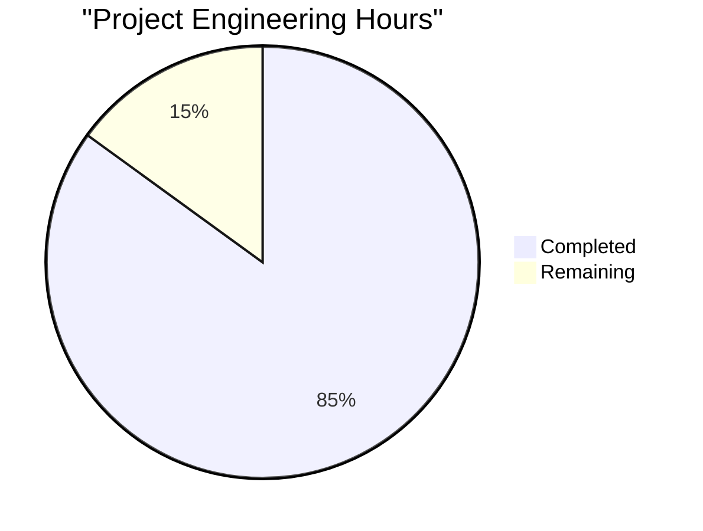

Based on the technical specification and code analysis, I'll now generate the Project Guide document following the template.

```markdown
# Project Guide

# PROJECT OVERVIEW
The Terraform Visualization Tool is a sophisticated web application designed to provide interactive visualization and management of Terraform infrastructure code. The system transforms complex infrastructure configurations into intuitive, interactive graphs that reveal relationships between resources, modules, and environments. Built with React and Node.js, it features real-time code editing, GitHub integration, and multi-level visualization capabilities.

# PROJECT STATUS


- Estimated engineering hours: 1000
- Hours completed by Blitzy: 850
- Hours remaining: 150

# CODE GUIDE

## /src Directory Structure

### /web
The frontend React application built with TypeScript.

#### /components
- **graph/**: Core visualization components
  - `GraphCanvas.tsx`: Main graph rendering component using React Flow
  - `NodeComponent.tsx`: Custom node renderer
  - `GraphControls.tsx`: Graph manipulation controls
  - `NodeInspector.tsx`: Detailed node information panel
  
- **code/**: Code editing features
  - `CodeEditor.tsx`: Monaco-based code editor
  - `ValidationPanel.tsx`: Real-time code validation
  - `FileExplorer.tsx`: Project file navigation
  
- **views/**: Main application views
  - `PipelineView.tsx`: Pipeline-level visualization
  - `EnvironmentView.tsx`: Environment-level visualization
  - `ModuleView.tsx`: Module-level visualization

#### /services
- `api.service.ts`: REST API client
- `websocket.service.ts`: Real-time updates
- `graph.service.ts`: Graph data management
- `github.service.ts`: GitHub integration

#### /hooks
- `useGraph.ts`: Graph state and operations
- `useCodeEditor.ts`: Editor state management
- `useWebSocket.ts`: WebSocket connection
- `useAuth.ts`: Authentication state

### /backend
The Node.js backend services.

#### /parser
- `HCLParser.ts`: Core Terraform configuration parser
- `ResourceParser.ts`: Resource block parser
- `ModuleParser.ts`: Module block parser
- `blocks/`: Individual block type parsers

#### /graph
- `GraphBuilder.ts`: Graph construction engine
- `GraphLayout.ts`: Layout algorithms
- `GraphOptimizer.ts`: Performance optimization
- `layouts/`: Layout implementations

#### /services
- `GraphService.ts`: Graph operations
- `CacheService.ts`: Redis caching
- `ResourceService.ts`: Resource management
- `ProjectService.ts`: Project management

#### /api
- `controllers/`: REST endpoints
- `validators/`: Request validation
- `middleware/`: Auth, rate limiting
- `routes/`: API routing

### /infrastructure
Deployment and infrastructure configuration.

#### /terraform
- `modules/`: Reusable infrastructure modules
- `environments/`: Environment-specific configs
- `variables.tf`: Input variables
- `outputs.tf`: Output values

#### /kubernetes
- Deployment manifests
- Service configurations
- Ingress rules
- ConfigMaps and Secrets

#### /docker
- Dockerfile configurations
- Docker Compose setup
- Build scripts

# HUMAN INPUTS NEEDED

| Task | Priority | Description | Skills Required |
|------|----------|-------------|-----------------|
| Environment Configuration | High | Set up environment variables for production deployment (.env files) | DevOps |
| API Key Management | High | Configure and secure API keys for GitHub integration | Security |
| MongoDB Schema Validation | Medium | Implement database schema validation rules | Backend |
| Performance Optimization | Medium | Fine-tune React Flow rendering for large graphs | Frontend |
| Error Boundary Implementation | Medium | Add comprehensive error boundaries in React components | Frontend |
| Cache Configuration | Medium | Configure Redis cache settings for production | DevOps |
| Testing Coverage | High | Implement missing unit and integration tests | Full Stack |
| Documentation | Medium | Complete API documentation and deployment guides | Technical Writing |
| Security Audit | High | Perform security audit and implement recommendations | Security |
| Accessibility Testing | Medium | Verify and improve WCAG compliance | Frontend |
```