# Technical Specifications

# 1. INTRODUCTION

## 1.1 EXECUTIVE SUMMARY

The Terraform Visualization Tool is a web-based application designed to provide interactive visualization and management of Terraform infrastructure code. The system addresses the critical challenge of understanding complex infrastructure relationships and dependencies across multiple environments and modules. By offering multi-level visualization capabilities, real-time code editing, and GitHub integration, the tool enables infrastructure teams to effectively manage, understand, and maintain their Infrastructure as Code (IaC) implementations.

The solution serves infrastructure engineers, DevOps teams, and system architects by transforming text-based Terraform configurations into intuitive, interactive graphs that reveal relationships between resources, modules, and environments. This visualization capability significantly reduces the time required to understand infrastructure dependencies and helps prevent configuration errors.

## 1.2 SYSTEM OVERVIEW

### Project Context

| Aspect | Description |
|--------|-------------|
| Business Context | Growing complexity in infrastructure management requiring better visualization tools |
| Market Position | Specialized tool for Terraform users requiring deep insight into infrastructure relationships |
| Current Limitations | Text-based configurations make understanding relationships difficult |
| Enterprise Integration | Seamless integration with existing GitHub workflows and Terraform configurations |

### High-Level Description

| Component | Implementation |
|-----------|---------------|
| Visualization Engine | React Flow-based interactive graph rendering |
| Parser System | HCL2-compliant Terraform configuration parser |
| Code Editor | Real-time editing with automatic visualization updates |
| Version Control | GitHub integration for project management |
| View Management | Three-tier visualization system (Pipeline, Environment, Module) |

### Success Criteria

| Criterion | Target Metric |
|-----------|--------------|
| Parse Performance | < 3 seconds for standard Terraform files |
| Visualization Response | < 1 second for graph updates |
| User Adoption | > 80% team utilization within 3 months |
| Error Reduction | 50% reduction in configuration-related incidents |

## 1.3 SCOPE

### In-Scope Elements

#### Core Features and Functionalities

| Feature Category | Included Capabilities |
|-----------------|----------------------|
| Parsing | Resource, data, module, variable, output, and provider blocks |
| Visualization | Interactive graphs, three-level view system, real-time updates |
| Code Management | In-browser editing, syntax highlighting, validation |
| Version Control | GitHub import/export, repository synchronization |
| Navigation | Cross-view transitions, context preservation |

#### Implementation Boundaries

| Boundary Type | Coverage |
|--------------|----------|
| User Groups | Infrastructure engineers, DevOps teams, system architects |
| Technical Scope | Terraform HCL2 configurations |
| Platform Support | Modern web browsers (Chrome, Firefox, Safari) |
| Data Coverage | All standard Terraform block types and relationships |

### Out-of-Scope Elements

| Category | Excluded Elements |
|----------|------------------|
| Features | - Terraform plan/apply execution<br>- Infrastructure provisioning<br>- Cost estimation<br>- Custom provider development |
| Integrations | - CI/CD pipeline execution<br>- Cloud provider direct integration<br>- Infrastructure monitoring<br>- Compliance scanning |
| Support | - Legacy HCL syntax<br>- Custom block types<br>- Third-party Terraform providers<br>- Offline mode operation |
| Future Considerations | - Multi-user collaboration features<br>- Advanced access control<br>- Custom visualization templates<br>- Infrastructure drift detection |

# 2. SYSTEM ARCHITECTURE

## 2.1 HIGH-LEVEL ARCHITECTURE

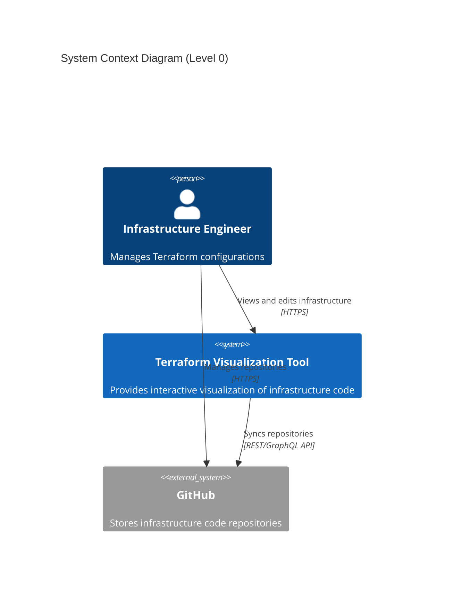

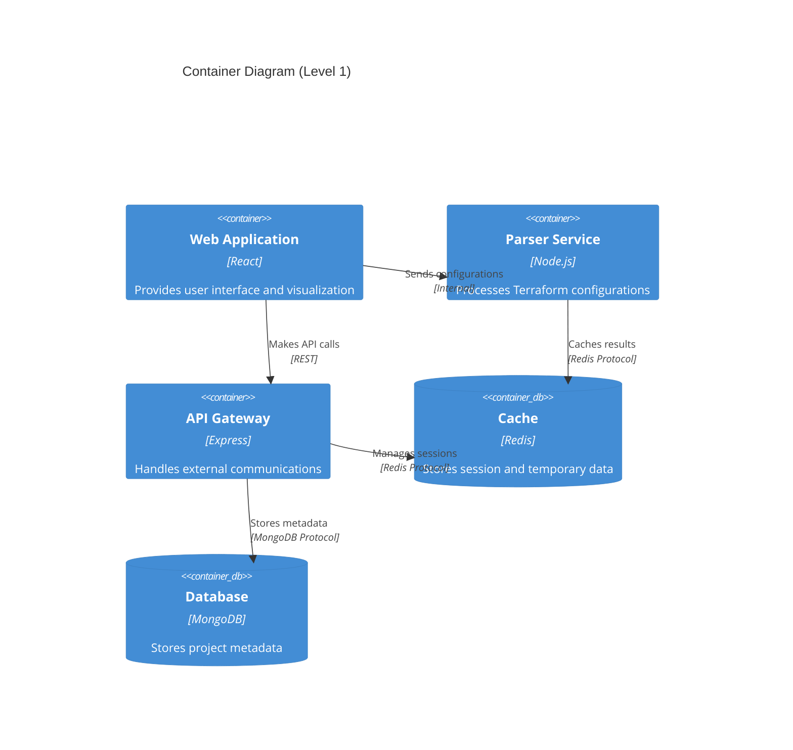

## 2.2 COMPONENT DETAILS

### 2.2.1 Core Components

| Component | Purpose | Technology Stack | Scaling Strategy |
|-----------|---------|-----------------|------------------|
| Frontend Application | User interface and visualization | React, React Flow, Monaco Editor | Horizontal scaling with CDN |
| Parser Service | HCL processing and graph generation | Node.js, HCL2 Parser | Stateless horizontal scaling |
| API Gateway | External communication management | Express.js, Node.js | Load-balanced horizontal scaling |
| Cache Layer | Performance optimization | Redis | Master-replica configuration |
| Database | Persistent storage | MongoDB | Sharded clustering |

### 2.2.2 Component Interactions

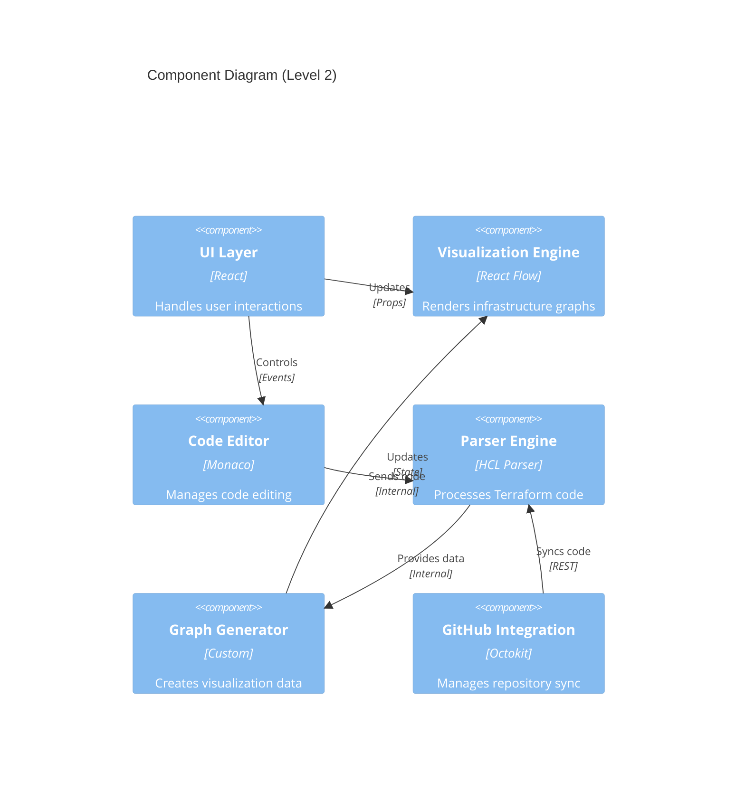

## 2.3 TECHNICAL DECISIONS

### 2.3.1 Architecture Patterns

| Pattern | Implementation | Justification |
|---------|---------------|---------------|
| Monolithic Frontend | Single React Application | Simplified state management and deployment |
| Microservices Backend | Separate Parser and API Services | Independent scaling and maintenance |
| Event-Driven Updates | WebSocket Real-time Communication | Immediate visualization updates |
| CQRS | Separate Read/Write Operations | Optimized query and update paths |

### 2.3.2 Data Flow Architecture

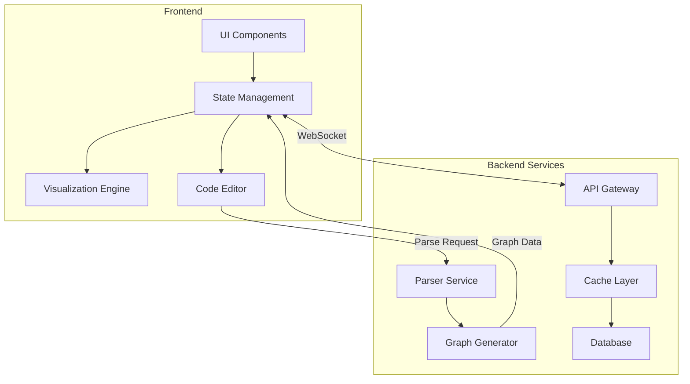

## 2.4 CROSS-CUTTING CONCERNS

### 2.4.1 System Monitoring

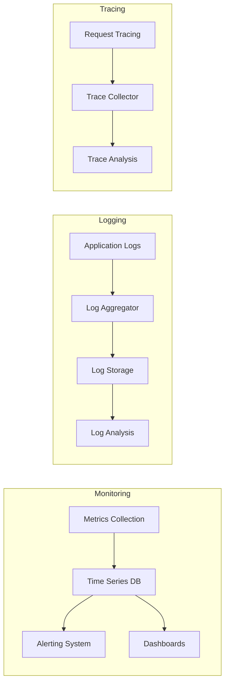

### 2.4.2 Security Architecture

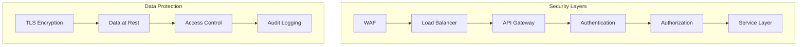

## 2.5 DEPLOYMENT ARCHITECTURE

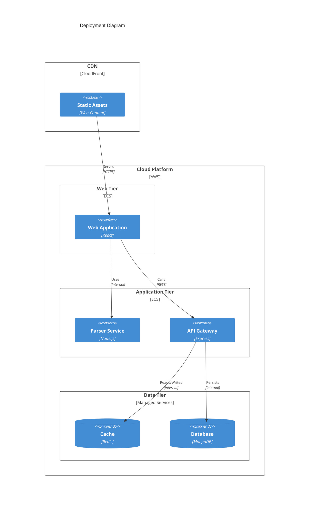

# 3. SYSTEM COMPONENTS ARCHITECTURE

## 3.1 USER INTERFACE DESIGN

### 3.1.1 Design Specifications

| Aspect | Requirement | Details |
|--------|-------------|---------|
| Visual Hierarchy | Three-tier navigation | Pipeline > Environment > Module views |
| Component Library | Material-UI v5 | Consistent with React ecosystem |
| Responsive Design | Mobile-first approach | Breakpoints: 320px, 768px, 1024px, 1440px |
| Accessibility | WCAG 2.1 Level AA | Focus management, keyboard navigation, ARIA labels |
| Browser Support | Modern browsers | Chrome 90+, Firefox 88+, Safari 14+, Edge 90+ |
| Theme Support | Dark/Light modes | System preference detection, manual toggle |
| Internationalization | English only (Phase 1) | UTF-8 encoding, extensible structure |

### 3.1.2 Layout Structure

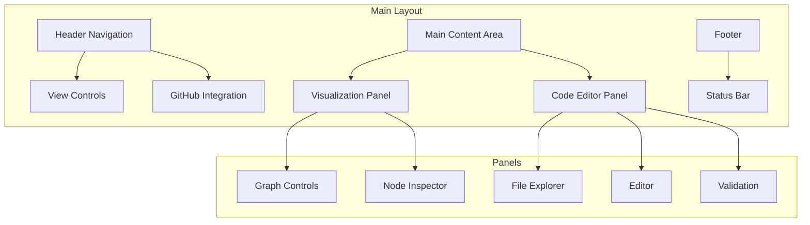

### 3.1.3 Critical User Flows

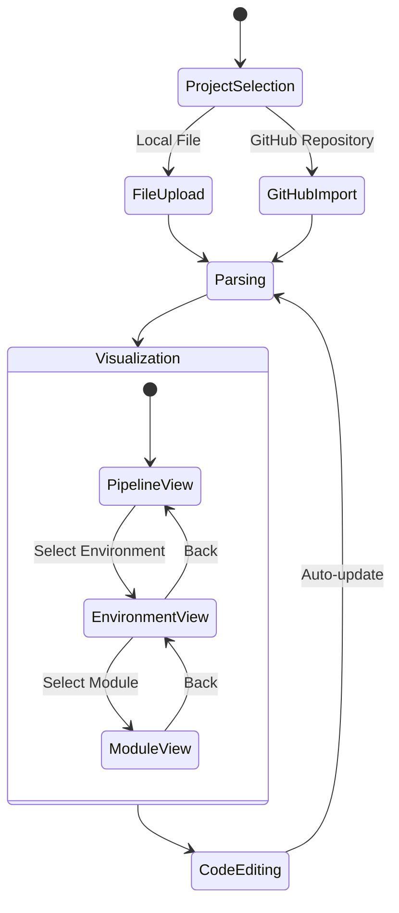

### 3.1.4 Component Specifications

| Component | Behavior | Validation Rules |
|-----------|----------|-----------------|
| Graph Canvas | Zoomable, pannable | Min/max zoom levels: 0.1x - 3x |
| Node Elements | Draggable, selectable | Snap-to-grid, collision detection |
| Code Editor | Split-pane resizable | Syntax validation, auto-formatting |
| File Tree | Collapsible hierarchy | File type filtering |
| Search Bar | Real-time filtering | Min 3 characters, debounced input |
| Error Tooltips | Hover-activated | Max width 300px, auto-dismiss |

## 3.2 DATABASE DESIGN

### 3.2.1 Schema Design

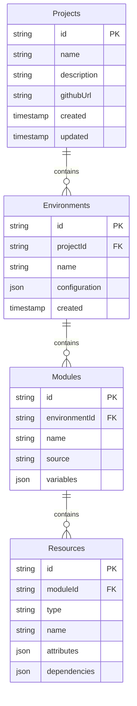

### 3.2.2 Data Management Strategy

| Aspect | Strategy | Implementation |
|--------|----------|----------------|
| Versioning | Semantic versioning | Major.Minor.Patch format |
| Migration | Forward-only | Numbered migration scripts |
| Retention | 90-day history | Soft-delete with archive tables |
| Auditing | Change tracking | Separate audit collection |
| Backup | Daily full + hourly incremental | MongoDB native backup |
| Security | Field-level encryption | Sensitive data protection |

### 3.2.3 Performance Optimization

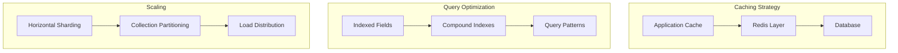

## 3.3 API DESIGN

### 3.3.1 API Architecture

| Component | Specification | Details |
|-----------|--------------|----------|
| Protocol | REST/WebSocket | HTTPS/WSS |
| Authentication | JWT + OAuth 2.0 | GitHub integration |
| Rate Limiting | 100 req/min | Token bucket algorithm |
| Versioning | URI-based | /api/v1/* |
| Documentation | OpenAPI 3.0 | Swagger UI integration |
| Security | CORS, CSP | Whitelisted origins |

### 3.3.2 Endpoint Specifications

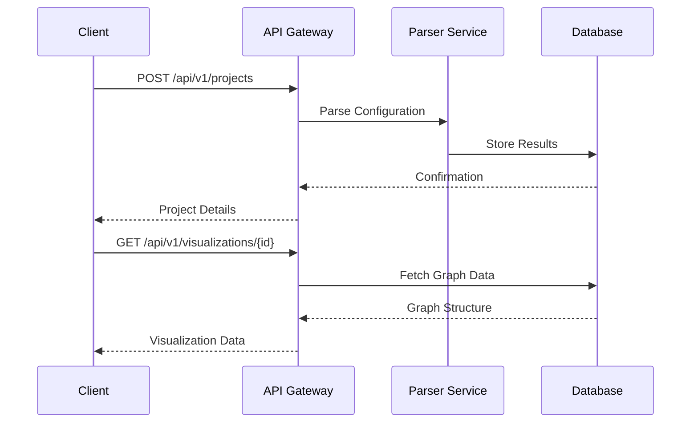

### 3.3.3 Integration Patterns

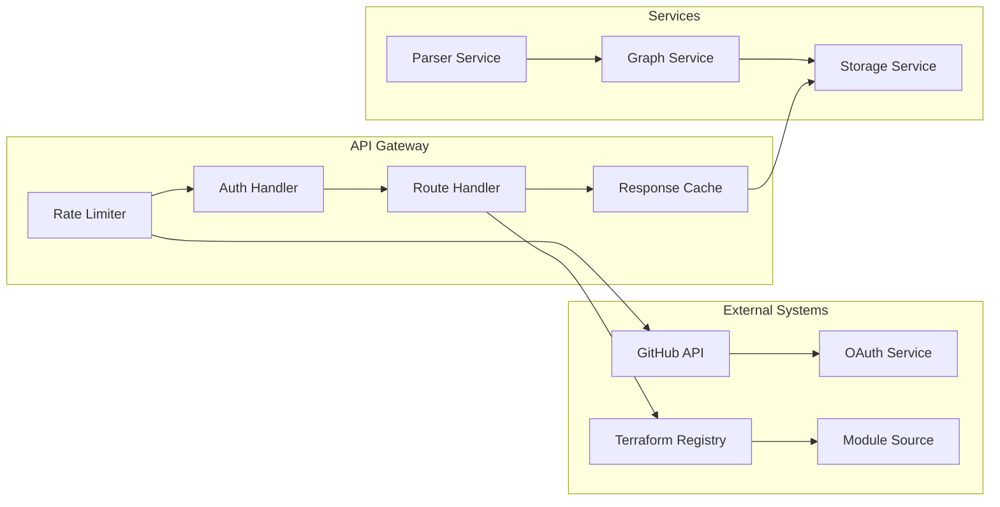

# 4. TECHNOLOGY STACK

## 4.1 PROGRAMMING LANGUAGES

| Platform/Component | Language | Version | Justification |
|-------------------|----------|---------|---------------|
| Frontend | TypeScript | 4.9.x | Type safety, enhanced IDE support, better maintainability |
| Backend Services | Node.js | 18.x LTS | JavaScript ecosystem compatibility, async performance |
| Build Tools | JavaScript | ES2022 | Native build script support, ecosystem compatibility |
| Infrastructure | HCL | 2.x | Native Terraform configuration language |

## 4.2 FRAMEWORKS & LIBRARIES

### 4.2.1 Core Frameworks

| Framework | Version | Purpose | Justification |
|-----------|---------|---------|---------------|
| React | 18.x | UI Framework | Component reusability, virtual DOM performance |
| Express.js | 4.x | API Gateway | Lightweight, middleware ecosystem |
| React Flow | 11.x | Graph Visualization | Built-in node/edge handling, React integration |
| Material-UI | 5.x | UI Components | Consistent design system, accessibility |

### 4.2.2 Supporting Libraries

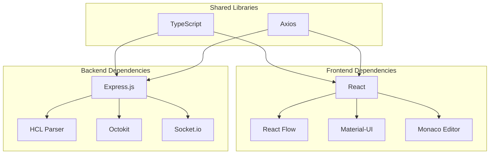

## 4.3 DATABASES & STORAGE

### 4.3.1 Primary Storage Solutions

| Type | Technology | Version | Purpose |
|------|------------|---------|----------|
| Document Store | MongoDB | 6.0.x | Project metadata, user data |
| Cache Layer | Redis | 7.0.x | Session management, real-time data |
| File Storage | S3 | - | Configuration file storage |
| Local Storage | IndexedDB | - | Client-side state persistence |

### 4.3.2 Data Flow Architecture

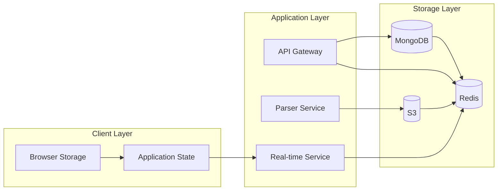

## 4.4 THIRD-PARTY SERVICES

| Service | Purpose | Integration Method |
|---------|---------|-------------------|
| GitHub API | Repository management | REST/GraphQL API |
| AWS Services | Infrastructure hosting | SDK/API |
| CloudFront | Content delivery | Direct integration |
| DataDog | Monitoring and APM | Agent/API |
| Auth0 | Authentication | OAuth 2.0 |

## 4.5 DEVELOPMENT & DEPLOYMENT

### 4.5.1 Development Tools

| Tool | Version | Purpose |
|------|---------|----------|
| VS Code | Latest | Primary IDE |
| ESLint | 8.x | Code quality |
| Prettier | 2.x | Code formatting |
| Jest | 29.x | Testing framework |
| Cypress | 12.x | E2E testing |

### 4.5.2 Deployment Pipeline

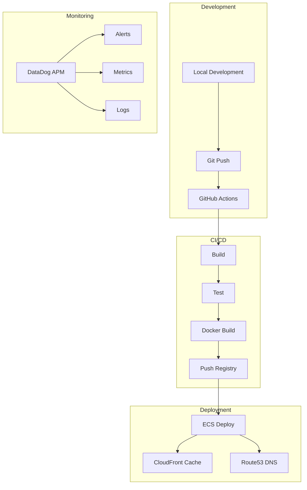

### 4.5.3 Infrastructure Components

| Component | Technology | Configuration |
|-----------|------------|---------------|
| Container Runtime | Docker | 20.10.x |
| Container Orchestration | ECS | Fargate |
| Load Balancer | ALB | Application |
| DNS Management | Route53 | Alias records |
| SSL/TLS | ACM | Auto-renewal |

### 4.5.4 Build System

| Stage | Tool | Purpose |
|-------|------|----------|
| Package Management | npm/yarn | Dependency management |
| Bundling | Webpack 5 | Asset optimization |
| Transpilation | Babel 7 | Cross-browser compatibility |
| Type Checking | TypeScript | Static analysis |
| Testing | Jest/Cypress | Quality assurance |

# 5. SYSTEM DESIGN

## 5.1 USER INTERFACE DESIGN

### 5.1.1 Layout Structure

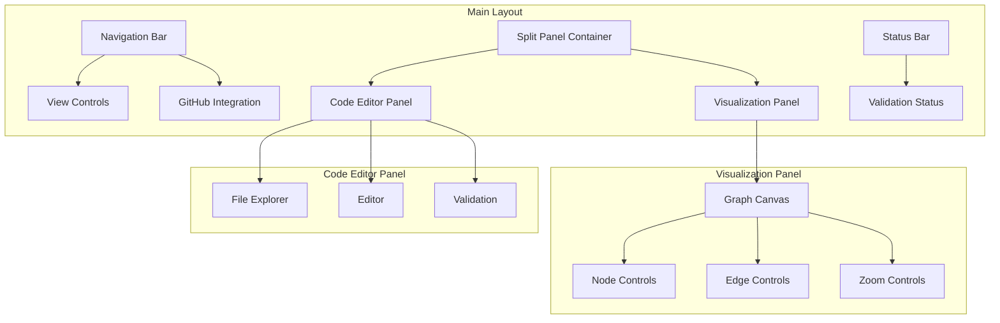

### 5.1.2 Component Specifications

| Component | Description | Behavior |
|-----------|-------------|-----------|
| Navigation Bar | Fixed top bar | Contains view switcher and GitHub controls |
| View Controls | Segmented control | Switches between Pipeline/Environment/Module views |
| Split Panel | Resizable container | Adjustable ratio between visualization and code |
| Graph Canvas | Interactive area | Supports pan, zoom, drag-drop of nodes |
| Code Editor | Monaco-based editor | Real-time syntax highlighting and validation |
| File Explorer | Tree structure | Hierarchical display of project files |

### 5.1.3 View Transitions

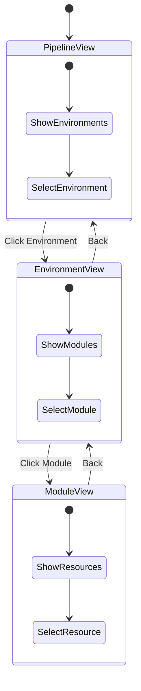

## 5.2 DATABASE DESIGN

### 5.2.1 Data Models

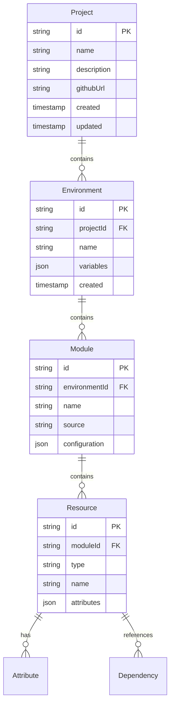

### 5.2.2 Collections Schema

| Collection | Purpose | Indexes |
|------------|---------|---------|
| projects | Store project metadata | name, githubUrl |
| environments | Environment configurations | projectId, name |
| modules | Module definitions | environmentId, name |
| resources | Resource configurations | moduleId, type |
| dependencies | Resource relationships | sourceId, targetId |

### 5.2.3 Data Flow

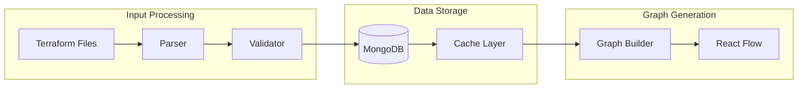

## 5.3 API DESIGN

### 5.3.1 REST Endpoints

| Endpoint | Method | Purpose | Request/Response |
|----------|---------|---------|-----------------|
| /api/projects | POST | Create project | Project metadata |
| /api/projects/{id}/environments | GET | List environments | Environment array |
| /api/environments/{id}/modules | GET | List modules | Module array |
| /api/modules/{id}/resources | GET | List resources | Resource array |
| /api/graph/{id} | GET | Get visualization data | Graph structure |

### 5.3.2 WebSocket Events

| Event | Direction | Purpose | Payload |
|-------|-----------|---------|---------|
| code.update | Client → Server | Code changes | File content |
| graph.update | Server → Client | Graph updates | Node/Edge data |
| validation.result | Server → Client | Validation status | Error/Warning list |
| sync.status | Server → Client | GitHub sync status | Sync state |

### 5.3.3 Integration Flow

```mermaid
sequenceDiagram
    participant Client
    participant API
    participant Parser
    participant Database
    participant GitHub
    
    Client->>API: Upload Terraform Files
    API->>Parser: Parse Configuration
    Parser->>Database: Store Results
    
    Client->>API: Request Visualization
    API->>Database: Fetch Graph Data
    Database-->>Client: Return Visualization
    
    Client->>GitHub: Authenticate
    GitHub-->>Client: Auth Token
    Client->>API: Sync Repository
    API->>GitHub: Fetch Content
    GitHub-->>API: Repository Data
    API->>Parser: Process Files
    Parser->>Database: Update Data
```

# 6. USER INTERFACE DESIGN

## 6.1 WIREFRAME KEY

```
NAVIGATION & ACTIONS          STATES & INPUTS           CONTAINERS
[#] Dashboard/Menu           [ ] Checkbox              +---+ Border
[=] Settings                 ( ) Radio button          |   | Panel
[?] Help                     [...] Text input          +--  Tree view
[+] Add/Create              [v] Dropdown              >--  Sub-item
[x] Close/Delete            [====] Progress bar
[<] [>] Navigation          [Button] Action button
[^] Upload                  
[@] User profile            
[!] Warning                 
[*] Favorite
```

## 6.2 MAIN APPLICATION LAYOUT

```
+--------------------------------------------------------------------------------+
|  [#] Terraform Visualizer                                [@] Profile  [?] Help   |
+--------------------------------------------------------------------------------+
|  [<] Back | Pipeline > Environment > Module             [=] Settings  [^] Upload |
+--------------------------------------------------------------------------------+
|                                      |                                          |
|    +-------------------------+       |     +--------------------------------+   |
|    |  Visualization Panel    |       |     |  Code Editor                   |   |
|    |                        |       |     |  +----------------------------+ |   |
|    |  [+] Add Node          |       |     |  | File Explorer             | |   |
|    |  [-] Remove Node       |       |     |  | main.tf                   | |   |
|    |  [*] Center View       |       |     |  | >-- variables.tf          | |   |
|    |                        |       |     |  | >-- outputs.tf            | |   |
|    |  +------------------+  |       |     |  +----------------------------+ |   |
|    |  |                  |  |       |     |                                |   |
|    |  |   React Flow     |  |       |     |  +----------------------------+ |   |
|    |  |     Canvas       |  |       |     |  | resource "aws_instance" {  | |   |
|    |  |                  |  |       |     |  |   ami = "ami-123"         | |   |
|    |  |                  |  |       |     |  |   instance_type = "t2"    | |   |
|    |  +------------------+  |       |     |  | }                         | |   |
|    |                        |       |     |  +----------------------------+ |   |
|    +-------------------------+       |     |                                |   |
|                                      |     |  [!] Validation Errors (0)     |   |
|                                      |     +--------------------------------+   |
|                                      |                                          |
+--------------------------------------------------------------------------------+
|  Status: Connected to GitHub | Auto-save enabled | Last saved: 2 mins ago       |
+--------------------------------------------------------------------------------+
```

## 6.3 PIPELINE VIEW

```
+--------------------------------------------------------------------------------+
|  View: Pipeline                                        [+] Add Environment       |
+--------------------------------------------------------------------------------+
|                                                                                 |
|    +---------------+        +---------------+        +---------------+          |
|    |  Development  |  -->   |    Staging    |  -->   | Production    |          |
|    |  [*] Active   |        |               |        |               |          |
|    +---------------+        +---------------+        +---------------+          |
|          |                        |                        |                   |
|          v                        v                        v                   |
|    [Module Count: 5]        [Module Count: 5]        [Module Count: 5]        |
|    [Resources: 12]          [Resources: 12]          [Resources: 12]          |
|    [Last Update: 1h]        [Last Update: 2h]        [Last Update: 1d]        |
|                                                                                 |
+--------------------------------------------------------------------------------+
```

## 6.4 ENVIRONMENT VIEW

```
+--------------------------------------------------------------------------------+
|  Environment: Development                              [+] Add Module            |
+--------------------------------------------------------------------------------+
|                                                                                 |
|    +---------------+     +----------------+     +------------------+            |
|    |  VPC Module   | --> | Compute Module | --> | Database Module  |            |
|    |  [Resources:3] |     | [Resources:4]  |     | [Resources:2]    |            |
|    +---------------+     +----------------+     +------------------+            |
|           |                     |                       |                       |
|           v                     v                       v                       |
|    [Status: Valid]       [Status: Warning]      [Status: Valid]                |
|    [Version: 1.2]        [Version: 2.0]         [Version: 1.0]                |
|                                                                                 |
+--------------------------------------------------------------------------------+
```

## 6.5 MODULE VIEW

```
+--------------------------------------------------------------------------------+
|  Module: Compute                                      [+] Add Resource          |
+--------------------------------------------------------------------------------+
|                                                                                 |
|    +------------------+     +------------------+     +------------------+       |
|    | aws_instance     | --> | aws_eip          | --> | aws_security_group|       |
|    | web_server       |     | elastic_ip       |     | allow_http       |       |
|    +------------------+     +------------------+     +------------------+       |
|           |                        |                        |                   |
|           v                        v                        v                   |
|    [Type: Resource]         [Type: Resource]         [Type: Resource]          |
|    [Provider: AWS]          [Provider: AWS]          [Provider: AWS]           |
|    [Dependencies: 2]        [Dependencies: 1]        [Dependencies: 0]          |
|                                                                                 |
+--------------------------------------------------------------------------------+
```

## 6.6 SETTINGS PANEL

```
+--------------------------------------------------------------------------------+
|  Settings                                             [x] Close                  |
+--------------------------------------------------------------------------------+
|                                                                                 |
|    GitHub Integration                                                           |
|    [x] Enable Auto-sync                                                         |
|    Repository: [...........................] [Connect]                          |
|    Branch: [v] main                                                            |
|                                                                                 |
|    Visualization                                                                |
|    [x] Show Resource Types                                                      |
|    [x] Show Dependencies                                                        |
|    [ ] Show Attributes                                                          |
|    Layout: [v] Hierarchical                                                     |
|                                                                                 |
|    Editor                                                                       |
|    [x] Auto-save                                                               |
|    [x] Syntax Highlighting                                                      |
|    [ ] Auto-format on save                                                      |
|    Theme: [v] Dark                                                             |
|                                                                                 |
|    [Save Changes]                    [Reset to Defaults]                        |
+--------------------------------------------------------------------------------+
```

## 6.7 RESPONSIVE BEHAVIOR

### 6.7.1 Mobile View (< 768px)
```
+------------------------+
| [#] TF Visualizer [@] |
+------------------------+
| [v] View Selection    |
+------------------------+
| [Button] Toggle Editor|
+------------------------+
|                      |
|   Visualization      |
|   Panel             |
|   (Full Width)      |
|                      |
+------------------------+
| [Button] Toggle Files |
+------------------------+
```

### 6.7.2 Tablet View (768px - 1199px)
```
+--------------------------------+
| [#] TF Visualizer        [@]   |
+--------------------------------+
| [v] View    |  [Button] Editor |
+--------------------------------+
|                      |        |
|   Visualization     |        |
|   Panel            | Editor  |
|   (60%)            | (40%)   |
|                      |        |
+--------------------------------+
```

## 6.8 INTERACTION STATES

### 6.8.1 Node Selection
```
+------------------+
| Selected Node    |
|------------------|
| Type: Resource   |
| Name: web_server |
| Provider: AWS    |
|                  |
| [Edit] [Delete]  |
+------------------+
```

### 6.8.2 Validation Errors
```
+------------------+
| [!] Validation   |
|------------------|
| > Line 15: Missing|
|   required field  |
| > Line 22: Invalid|
|   resource type   |
|                  |
| [Fix] [Ignore]   |
+------------------+
```

# 7. SECURITY CONSIDERATIONS

## 7.1 AUTHENTICATION AND AUTHORIZATION

### 7.1.1 Authentication Flow

```mermaid
sequenceDiagram
    participant User
    participant App
    participant Auth0
    participant GitHub
    participant API
    
    User->>App: Access Application
    App->>Auth0: Redirect to Login
    Auth0->>GitHub: OAuth Request
    GitHub->>Auth0: OAuth Token
    Auth0->>App: JWT Token
    App->>API: API Request + JWT
    API->>App: Authorized Response
```

### 7.1.2 Authorization Levels

| Role | Permissions | Access Scope |
|------|------------|--------------|
| Viewer | Read-only access to visualizations and code | Public repositories, shared projects |
| Editor | Modify code, update visualizations | Assigned repositories, team projects |
| Admin | Full access, manage users, configure settings | All repositories, system settings |
| System | Automated processes, background tasks | Internal services, monitoring |

### 7.1.3 Token Management

| Token Type | Lifetime | Refresh Policy | Storage |
|------------|----------|----------------|---------|
| JWT Access | 1 hour | On expiration | Memory only |
| GitHub OAuth | 8 hours | Using refresh token | HTTP-only cookie |
| API Key | 30 days | Manual rotation | Encrypted storage |
| Refresh Token | 30 days | On OAuth refresh | Secure cookie |

## 7.2 DATA SECURITY

### 7.2.1 Data Classification

| Data Type | Sensitivity | Encryption | Storage Location |
|-----------|-------------|------------|------------------|
| Terraform Configurations | High | AES-256 | MongoDB (encrypted) |
| User Credentials | Critical | Argon2 | Auth0 |
| Session Data | Medium | AES-256 | Redis |
| Visualization Data | Low | TLS in transit | Memory/Cache |
| GitHub Tokens | Critical | AES-256 | Secure cookie |

### 7.2.2 Encryption Architecture

```mermaid
flowchart TD
    subgraph Data Flow
        A[Client Data] -->|TLS 1.3| B[API Gateway]
        B -->|AES-256| C[Application Layer]
        C -->|Encrypted| D[(Database)]
    end
    
    subgraph Key Management
        E[KMS] -->|Rotation| F[Master Key]
        F -->|Derivation| G[Data Keys]
        G -->|Encryption| C
    end
    
    subgraph Access Control
        H[IAM] -->|Policies| B
        H -->|Permissions| D
    end
```

### 7.2.3 Data Protection Measures

| Protection Layer | Implementation | Purpose |
|-----------------|----------------|----------|
| Transport | TLS 1.3 | Secure data in transit |
| Application | Input validation, sanitization | Prevent injection attacks |
| Database | Field-level encryption | Protect sensitive data |
| File System | Volume encryption | Secure stored data |
| Memory | Secure garbage collection | Prevent data leaks |

## 7.3 SECURITY PROTOCOLS

### 7.3.1 Security Standards Compliance

| Standard | Implementation | Validation |
|----------|----------------|------------|
| OWASP Top 10 | Security controls for each risk | Quarterly assessment |
| GDPR | Data protection measures | Annual audit |
| SOC 2 | Security controls and monitoring | Continuous monitoring |
| PCI DSS | Secure data handling | Regular scanning |

### 7.3.2 Security Monitoring

```mermaid
flowchart LR
    subgraph Detection
        A[WAF] -->|Alerts| B[SIEM]
        C[IDS/IPS] -->|Events| B
        D[Access Logs] -->|Analysis| B
    end
    
    subgraph Response
        B -->|Triggers| E[Alert System]
        E -->|Notifies| F[Security Team]
        E -->|Automated| G[Security Controls]
    end
    
    subgraph Prevention
        H[Rate Limiting] -->|Controls| A
        I[IP Filtering] -->|Rules| A
        J[Geo-blocking] -->|Policy| A
    end
```

### 7.3.3 Security Controls

| Control Type | Measure | Implementation |
|--------------|---------|----------------|
| Preventive | WAF | CloudFront + AWS WAF |
| Detective | Logging | CloudWatch + DataDog |
| Responsive | Alerting | PagerDuty integration |
| Deterrent | Rate limiting | API Gateway controls |
| Recovery | Backup | Automated daily backups |

### 7.3.4 Security Update Process

```mermaid
stateDiagram-v2
    [*] --> Monitoring
    Monitoring --> Detection: Security Issue
    Detection --> Assessment
    Assessment --> Planning
    Planning --> Implementation
    Implementation --> Testing
    Testing --> Deployment
    Deployment --> Monitoring
    Assessment --> Emergency: Critical Issue
    Emergency --> Deployment
```

### 7.3.5 Incident Response Plan

| Phase | Actions | Responsible Team |
|-------|---------|-----------------|
| Detection | Monitor alerts, identify threats | Security Operations |
| Analysis | Assess impact and scope | Security Team |
| Containment | Isolate affected systems | DevOps Team |
| Eradication | Remove threat source | Security Team |
| Recovery | Restore systems and data | DevOps Team |
| Lessons Learned | Document and improve | All Teams |

# 8. INFRASTRUCTURE

## 8.1 DEPLOYMENT ENVIRONMENT

| Environment Type | Primary Use | Configuration |
|-----------------|-------------|---------------|
| Production | Live system serving end users | AWS Multi-AZ, High Availability |
| Staging | Pre-production testing | AWS Single-AZ, Scaled-down replica |
| Development | Development and testing | AWS Single-AZ, Minimal resources |
| Local | Developer environments | Docker Compose, Local resources |

### Environment Specifications

```mermaid
flowchart TD
    subgraph Production
        A[Load Balancer] --> B[Web Tier AZ1]
        A --> C[Web Tier AZ2]
        B --> D[App Tier AZ1]
        C --> E[App Tier AZ2]
        D --> F[(Data Tier AZ1)]
        E --> G[(Data Tier AZ2)]
    end

    subgraph Staging/Development
        H[Load Balancer] --> I[Web Tier]
        I --> J[App Tier]
        J --> K[(Data Tier)]
    end
```

## 8.2 CLOUD SERVICES

| Service | Purpose | Configuration |
|---------|---------|---------------|
| AWS ECS | Container orchestration | Fargate launch type |
| AWS RDS | MongoDB database | Multi-AZ, t3.large |
| AWS ElastiCache | Redis caching | Cluster mode, r6g.large |
| AWS CloudFront | CDN and WAF | Global edge locations |
| AWS Route53 | DNS management | Latency-based routing |
| AWS S3 | Static assets, backups | Standard storage class |
| AWS KMS | Encryption key management | Automatic key rotation |

### Service Architecture

```mermaid
flowchart LR
    subgraph Frontend Delivery
        A[CloudFront] --> B[S3 Bucket]
        A --> C[ECS Services]
    end

    subgraph Application Layer
        C --> D[ECS Tasks]
        D --> E[ElastiCache]
        D --> F[RDS]
    end

    subgraph Security
        G[WAF] --> A
        H[KMS] --> F
        H --> E
    end
```

## 8.3 CONTAINERIZATION

### Container Strategy

| Component | Base Image | Size | Configuration |
|-----------|------------|------|---------------|
| Frontend | node:18-alpine | ~150MB | Multi-stage build |
| API Gateway | node:18-alpine | ~120MB | Multi-stage build |
| Parser Service | node:18-alpine | ~200MB | Multi-stage build |
| Redis | redis:7-alpine | ~40MB | Custom config |
| MongoDB | mongo:6 | ~500MB | Custom config |

### Docker Configuration

```mermaid
flowchart TD
    subgraph Images
        A[Base Images] --> B[Build Stage]
        B --> C[Production Stage]
    end

    subgraph Networking
        D[Internal Network] --> E[Frontend]
        D --> F[Backend Services]
        D --> G[Databases]
    end

    subgraph Volumes
        H[Config Volume] --> F
        I[Data Volume] --> G
    end
```

## 8.4 ORCHESTRATION

### ECS Configuration

| Service | Task Definition | Scaling Policy |
|---------|----------------|----------------|
| Frontend | 2 vCPU, 4GB RAM | 2-6 tasks, CPU 75% |
| API Gateway | 1 vCPU, 2GB RAM | 2-8 tasks, CPU 70% |
| Parser Service | 2 vCPU, 4GB RAM | 2-6 tasks, CPU 80% |

### Service Orchestration

```mermaid
flowchart TD
    subgraph ECS Cluster
        A[Application Load Balancer] --> B[Frontend Service]
        A --> C[API Gateway Service]
        B --> D[Parser Service]
        C --> D
    end

    subgraph Auto Scaling
        E[CloudWatch] --> F[Scaling Policy]
        F --> B
        F --> C
        F --> D
    end

    subgraph Service Discovery
        G[Route 53] --> A
        H[ECS Service Discovery] --> B
        H --> C
        H --> D
    end
```

## 8.5 CI/CD PIPELINE

### Pipeline Stages

| Stage | Tools | Actions |
|-------|-------|---------|
| Source | GitHub | Code checkout, branch protection |
| Build | Docker | Multi-stage builds, layer caching |
| Test | Jest, Cypress | Unit tests, integration tests |
| Security | OWASP ZAP, SonarQube | Security scanning, code quality |
| Deploy | AWS CDK, GitHub Actions | Infrastructure deployment |
| Monitor | DataDog | Performance monitoring |

### Pipeline Flow

```mermaid
flowchart LR
    subgraph CI Pipeline
        A[GitHub Push] --> B[Build Images]
        B --> C[Run Tests]
        C --> D[Security Scan]
        D --> E[Quality Gates]
    end

    subgraph CD Pipeline
        E --> F[Deploy Staging]
        F --> G[Integration Tests]
        G --> H[Deploy Production]
    end

    subgraph Post Deployment
        H --> I[Health Checks]
        I --> J[Performance Monitor]
    end
```

### Deployment Strategy

```mermaid
stateDiagram-v2
    [*] --> BuildStage
    BuildStage --> TestStage
    TestStage --> SecurityStage
    SecurityStage --> QualityGate
    QualityGate --> StagingDeploy
    StagingDeploy --> IntegrationTests
    IntegrationTests --> ProductionDeploy
    ProductionDeploy --> HealthCheck
    HealthCheck --> [*]
    
    ProductionDeploy --> Rollback: Failure
    Rollback --> [*]
```

# 9. APPENDICES

## 9.1 ADDITIONAL TECHNICAL INFORMATION

### 9.1.1 Terraform Block Types Support

| Block Type | Parser Support | Visualization | Notes |
|------------|---------------|---------------|--------|
| Resource | Full | Node with icon | Includes count/for_each support |
| Data | Full | Distinct node shape | Cached data handling |
| Module | Full | Nested graph | Cross-module references |
| Variable | Full | Input node | Default value display |
| Output | Full | Output node | Cross-module outputs |
| Provider | Partial | Configuration node | Version constraints |
| Locals | Full | Reference node | Expression evaluation |
| Backend | Metadata only | Configuration | State management |

### 9.1.2 Graph Layout Algorithms

```mermaid
flowchart TD
    subgraph Hierarchical
        A[Root Node] --> B[Child 1]
        A --> C[Child 2]
        B --> D[Grandchild]
    end

    subgraph Force-Directed
        E((Node 1)) --- F((Node 2))
        F --- G((Node 3))
        G --- E
    end

    subgraph Dagre
        H[Start] --> I[Middle]
        I --> J[End]
        H --> J
    end
```

## 9.2 GLOSSARY

| Term | Definition |
|------|------------|
| Attribute | A named argument within a Terraform block that configures a specific aspect |
| Backend | Configuration for where and how Terraform stores state |
| Count | Meta-argument for creating multiple instances of a resource |
| DAG | Directed Acyclic Graph representing resource dependencies |
| For Each | Meta-argument for creating multiple instances with unique configurations |
| HCL2 | Version 2 of HashiCorp Configuration Language |
| Local Value | Named value for reuse within a module |
| Pipeline | Sequence of environments representing deployment progression |
| State | Terraform's record of managed infrastructure and configuration |
| Workspace | Named state instances for managing multiple states from same configuration |

## 9.3 ACRONYMS

| Acronym | Full Form |
|---------|-----------|
| ACM | AWS Certificate Manager |
| ALB | Application Load Balancer |
| APM | Application Performance Monitoring |
| CDN | Content Delivery Network |
| CORS | Cross-Origin Resource Sharing |
| CSP | Content Security Policy |
| DAG | Directed Acyclic Graph |
| ECS | Elastic Container Service |
| HCL | HashiCorp Configuration Language |
| IDE | Integrated Development Environment |
| KMS | Key Management Service |
| RBAC | Role-Based Access Control |
| S3 | Simple Storage Service |
| SIEM | Security Information and Event Management |
| WAF | Web Application Firewall |
| WSS | WebSocket Secure |

## 9.4 PERFORMANCE BENCHMARKS

| Operation | Target Time | Maximum Load | Notes |
|-----------|------------|--------------|--------|
| Initial Parse | < 3s | 1MB file | Single module |
| Full Graph Render | < 1s | 100 nodes | With animations |
| View Transition | < 500ms | Any size | Smooth animation |
| Code Update | < 200ms | 1000 lines | Real-time sync |
| GitHub Sync | < 5s | 50MB repo | Including clone |

## 9.5 ERROR HANDLING MATRIX

```mermaid
flowchart LR
    subgraph Input Errors
        A[Syntax Error] --> E[Parser Response]
        B[Invalid Reference] --> E
        C[Missing Required] --> E
    end

    subgraph System Errors
        F[Network Timeout] --> J[Retry Logic]
        G[Memory Limit] --> K[Cleanup]
        H[API Error] --> L[Fallback]
    end

    subgraph User Feedback
        E --> M[Inline Highlight]
        J --> N[Status Message]
        K --> O[Error Dialog]
        L --> P[Notification]
    end
```

## 9.6 SUPPORTED TERRAFORM VERSIONS

| Version | Support Level | Features |
|---------|--------------|-----------|
| 1.5.x | Full | All current features |
| 1.4.x | Full | All features |
| 1.3.x | Partial | Core features only |
| 1.2.x | Limited | Basic parsing |
| < 1.2 | None | Not supported |